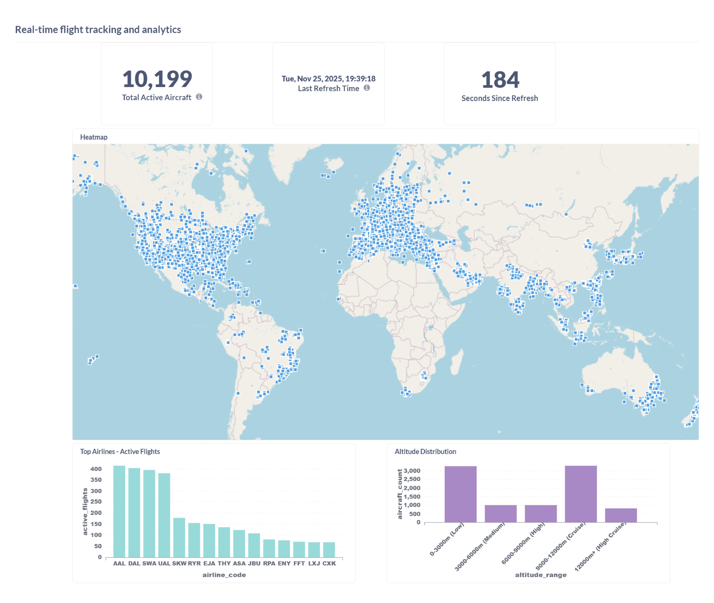

# Real-time Aviation Data Pipeline

A comprehensive real-time data pipeline that processes live flight data from the OpenSky API using Apache Kafka, Apache Iceberg, DuckDB, Dagster, and Metabase. This runs on my homelab currently which runs on Debian 12.12. But technically it should run on all amd64 architecture, for arm64 - you might have to change the docker images. 

## Architecture Overview

The pipeline follows this data flow:

1. **Data Ingestion**: Producer fetches live flight data from OpenSky API and publishes to Kafka
2. **Data Lake**: Consumer writes streaming data to Apache Iceberg tables with columnar storage
3. **Data Processing**: Dagster orchestrates data transformations and loads analytics tables into DuckDB
4. **Data Visualization**: Metabase provides interactive dashboards connected to DuckDB

### Technology Stack

- **Apache Kafka**: Distributed streaming platform with Schema Registry
- **Apache Iceberg**: Open table format for data lake storage
- **DuckDB**: In-process analytical database for fast queries
- **Dagster**: Data orchestration and pipeline management
- **Metabase**: Business intelligence and dashboard platform
- **Kubernetes**: Container orchestration via Minikube
- **Helm/Helmfile**: Kubernetes deployment management

## Architecture Diagram


## Dataset

This pipeline processes real-time flight data from the **OpenSky Network**, a non-profit organization that provides free access to worldwide air traffic data. The dataset includes:

### Data Source
- **API Endpoint**: OpenSky Network REST API (https://opensky-network.org/apidoc/rest.html)
- **Update Frequency**: Every 30 seconds (configurable)
- **Coverage**: Global flight tracking data
- **Data Format**: JSON responses converted to Avro for Kafka

### Flight Data Schema
Each flight record contains:
- **Aircraft Information**: ICAO24 address, callsign, origin country
- **Position Data**: Latitude, longitude, altitude (barometric and geometric)
- **Flight Dynamics**: Velocity, heading, vertical rate
- **Timestamps**: Last position update, last contact time
- **Status Flags**: On ground status, alert flags, SPI status

### Data Processing Pipeline
1. **Raw Data**: Stored in Apache Iceberg tables with full schema evolution support
2. **Cleaned Data**: Filtered for valid positions and active flights
3. **Analytics Tables**: 
   - Country-level flight statistics
   - Flight density grids for geographic analysis
   - Temporal patterns and trends
4. **Output Format**: Optimized Parquet files for fast analytical queries

The dataset typically processes 8,000-15,000 active flights globally at any given time, with data retention policies configurable based on storage requirements.

## Example Visualization

This is what the visualization can look like



## Project Structure

```
flight-club-data/
├── charts/                    # Helm charts for each service
│   ├── kafka/                 # Kafka cluster with KRaft mode
│   ├── schema-registry/       # Confluent Schema Registry
│   ├── producer/              # OpenSky API data producer
│   ├── consumer/              # Iceberg data consumer
│   ├── dagster/               # Data orchestration platform
│   ├── metabase/              # Dashboard and BI platform
│   ├── storage/               # Persistent volumes configuration
│   └── infrastructure/        # Kubernetes namespaces
├── config/                    # Configuration files
├── producer.py               # OpenSky API data fetcher
├── consumer.py               # Kafka to Iceberg data writer
├── aviation_pipeline.py      # Dagster data transformation pipeline
├── Helmfile.yaml            # Multi-service deployment orchestration
├── Taskfile.yml             # Automated deployment tasks
└── requirements-*.txt       # Service-specific Python dependencies
```

## Prerequisites

Before running this project locally, ensure you have the following tools installed:

### Required Tools

1. **Docker Desktop** - Container runtime
   ```bash
   # Install from https://docs.docker.com/get-docker/
   ```

2. **Minikube** - Local Kubernetes cluster
   ```bash
   # macOS with Homebrew
   brew install minikube
   
   # Linux
   curl -LO https://storage.googleapis.com/minikube/releases/latest/minikube-linux-amd64
   sudo install minikube-linux-amd64 /usr/local/bin/minikube
   ```

3. **kubectl** - Kubernetes command-line tool
   ```bash
   # macOS with Homebrew
   brew install kubectl
   
   # Linux
   curl -LO "https://dl.k8s.io/release/$(curl -L -s https://dl.k8s.io/release/stable.txt)/bin/linux/amd64/kubectl"
   sudo install kubectl /usr/local/bin/kubectl
   ```

4. **Helm** - Kubernetes package manager
   ```bash
   # macOS with Homebrew
   brew install helm
   
   # Linux
   curl https://raw.githubusercontent.com/helm/helm/main/scripts/get-helm-3 | bash
   ```

5. **Helmfile** - Helm deployment orchestration
   ```bash
   # macOS with Homebrew
   brew install helmfile
   
   # Linux
   wget https://github.com/helmfile/helmfile/releases/latest/download/helmfile_linux_amd64.tar.gz
   tar -xzf helmfile_linux_amd64.tar.gz
   sudo mv helmfile /usr/local/bin/
   ```

6. **Task** - Task runner and build tool
   ```bash
   # macOS with Homebrew
   brew install go-task/tap/go-task
   
   # Linux
   sh -c "$(curl --location https://taskfile.dev/install.sh)" -- -d -b /usr/local/bin
   ```

### System Requirements

Since its a real-time processing pipeline, I would recommend this atleast:

- **CPU**: Minimum 4 cores
- **RAM**: Minimum 16GB
- **Storage**: Minimum 50GB free space. Technically you could also archive old files and should not need so much space.
- **OS**: Linux, macOS, or Windows with WSL2

## Quick Start

### 1. Clone and Setup

```bash
git clone https://github.com/your-username/flight-club-data.git
cd flight-club-data
```

### 2. Configure Environment

Copy the example environment file and update with your credentials:

```bash
cp .env.example .env
```

Edit `.env` with your OpenSky API credentials:
```bash
# Get free credentials from https://opensky-network.org/apidoc/rest.html
OPENSKY_CLIENT_ID=your_username
OPENSKY_CLIENT_SECRET=your_password

# Database credentials (can leave defaults for local development)
DAGSTER_POSTGRES_USER=dagster
DAGSTER_POSTGRES_PASSWORD=dagster_password
DAGSTER_POSTGRES_DB=dagster
```

### 3. Customize Storage Path

Update the storage path in `Taskfile.yml` to match your system:

```yaml
vars:
  NVME_PATH: /your/storage/path  # Change this to your desired storage location
```

Common paths:
- Linux: `/home/your-username/data` or `/tmp/flight-data`
- macOS: `/Users/your-username/data` or `/tmp/flight-data`
- Windows WSL2: `/mnt/c/data` or `/tmp/flight-data`

### 4. Deploy Everything

```bash
# Single command deployment
task deploy
```

This command will:
- Install UV package manager automatically
- Start Minikube with proper configuration
- Create necessary storage directories
- Build all Docker images
- Deploy all services via Helmfile
- Show deployment status and access URLs

### 5. Access Services

After deployment, access the services via port forwarding:

```bash
# Dagster UI (data pipeline orchestration)
task port-forward-dagster
# Open http://localhost:3000

# Metabase (dashboards and analytics)
task port-forward-metabase
# Open http://localhost:3001

Elegant way would be create an ingress controller + configure SSL/TLS certificates + Add DNS + Add an "A record" in your domain registrar.
Or if you prefer easier way I would suggest CloudFlare tunnels, you don't have to worry about above steps for this.

But for the sake of homelab - I don't need internet access yet to my services. 
```

Or use Minikube service URLs (shown in deployment output):
```bash
# Get service URLs directly
minikube service dagster-webserver -n dagster --url
minikube service metabase -n dashboard --url
```


## Cleanup

To completely remove the deployment:

```bash
task destroy
```

This will:
- Delete all Kubernetes resources
- Remove Docker images
- Clean virtual environment
- Stop Minikube

## Contributing

1. Fork the repository
2. Create a feature branch: `git checkout -b feature-name`
3. Make changes and test locally: `task deploy`
4. Run code formatting: `ruff check . && black .`
5. Commit changes: `git commit -am 'Add feature'`
6. Push branch: `git push origin feature-name`
7. Create Pull Request

## License

This project is open-source and available under the MIT License.
