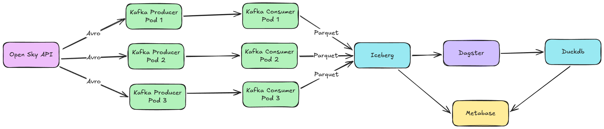
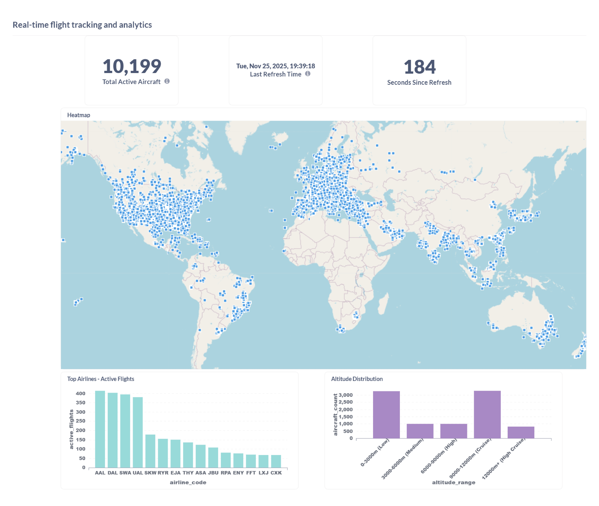

# Real-time Aviation Data Pipeline

A real-time data pipeline that processes live flight data from the OpenSky API using Apache Kafka, Apache Iceberg, DuckDB, dbt, Dagster, and Metabase. Originally built for a Debian 12 homelab, it now runs locally on Windows via WSL2 + Minikube. Should work on any amd64 machine - for arm64 you may need to swap Docker images.

## Architecture Overview

The pipeline follows this data flow:

1. **Data Ingestion**: Producer fetches live flight data from OpenSky API and publishes to Kafka (Avro + Schema Registry)
2. **Data Lake**: Consumer writes streaming data to Apache Iceberg tables backed by Parquet files
3. **Staging**: Dagster reads Iceberg → loads raw table into DuckDB
4. **Transformation**: dbt models clean, enrich, and aggregate the data into analytics tables
5. **Visualization**: Metabase provides interactive dashboards connected to DuckDB

### Technology Stack

- **Apache Kafka** (KRaft mode): Distributed streaming platform with Schema Registry
- **Apache Iceberg**: Open table format for data lake storage
- **DuckDB**: In-process analytical database for fast queries
- **dbt**: SQL transformation layer (staging + marts models)
- **Dagster**: Data orchestration with modular `ConfigurableResource` pattern
- **Metabase**: Business intelligence and dashboard platform
- **Kubernetes**: Container orchestration via Minikube (`--driver=docker` on WSL2)
- **Helm/Helmfile**: Kubernetes deployment management

## Architecture Diagram



## Dataset

This pipeline processes real-time flight data from the **OpenSky Network**, a non-profit that provides free access to worldwide air traffic data.

### Data Source
- **API Endpoint**: OpenSky Network REST API
- **Auth**: Anonymous access works (rate-limited to ~10s intervals). Register for higher limits.
- **Update Frequency**: Every 5 minutes (configurable via `FETCH_INTERVAL_SECONDS`)
- **Coverage**: Global flight tracking data
- **Data Format**: JSON → Avro for Kafka transport

### Flight Data Schema
Each flight record contains:
- **Aircraft**: ICAO24 transponder address, callsign, origin country
- **Position**: Latitude, longitude, barometric and geometric altitude
- **Dynamics**: Velocity, heading, vertical rate
- **Timestamps**: Last position update, last contact time, fetch timestamp
- **Status**: On-ground flag, alert flags, SPI status

### dbt Transformation Layers

| Layer | Model | Description |
|---|---|---|
| **Staging** | `stg_flights` | Deduplicated, coord-filtered, altitude/speed categories added |
| **Marts** | `country_stats` | Observations and unique aircraft per country |
| **Marts** | `hourly_activity` | Flight counts and averages bucketed by hour |
| **Marts** | `aircraft_stats` | Per-aircraft lifetime altitude and velocity extremes |
| **Marts** | `flight_density_grid` | 1° lat/lon grid cells with flight counts for heatmaps |

The pipeline typically sees 8,000–15,000 active flights globally at any given time.

## Example Visualization



## Project Structure

```
flight-club-data/
├── producer/                  # OpenSky API → Kafka producer
│   ├── producer.py
│   ├── requirements.txt
│   └── Dockerfile
├── consumer/                  # Kafka → Apache Iceberg consumer
│   ├── consumer.py
│   ├── requirements.txt
│   └── Dockerfile
├── dagster/                   # Dagster orchestration + dbt models
│   ├── aviation_pipeline/
│   │   ├── assets/
│   │   │   ├── ingest.py      # Iceberg → DuckDB raw table (raw_flight_data)
│   │   │   └── __init__.py    # @dbt_assets wired to dbt project
│   │   ├── resources/
│   │   │   ├── iceberg.py     # IcebergResource (ConfigurableResource)
│   │   │   └── duckdb.py      # DuckDBResource (ConfigurableResource)
│   │   ├── jobs.py
│   │   ├── schedules.py       # Daily run at 02:00 UTC
│   │   └── __init__.py        # Definitions: assets + resources + dbt
│   ├── dbt/
│   │   ├── models/
│   │   │   ├── staging/       # stg_flights.sql
│   │   │   └── marts/         # country_stats, hourly_activity, aircraft_stats, flight_density_grid
│   │   ├── dbt_project.yml
│   │   ├── profiles.yml       # Uses DUCKDB_PATH env var, falls back to :memory: at build time
│   │   ├── models/sources.yml # Declares raw_flight_data source
│   │   └── models/schema.yml  # dbt tests (not_null, unique, accepted_values)
│   ├── config/dagster.yaml
│   ├── workspace.yaml
│   ├── requirements.txt
│   └── Dockerfile
├── metabase/                  # Metabase + DuckDB driver
│   └── Dockerfile
├── charts/                    # Helm charts for each service
│   ├── kafka/                 # Single-broker Kafka in KRaft mode
│   ├── schema-registry/
│   ├── producer/
│   ├── consumer/
│   ├── dagster/               # Webserver + daemon + code-server
│   ├── metabase/
│   ├── storage/               # PersistentVolumes
│   └── infrastructure/        # Kubernetes namespaces
├── Helmfile.yaml              # Multi-service deployment orchestration
└── Taskfile.yml               # One-command deployment automation
```

## Prerequisites

### Required Tools

1. **Docker Desktop** (or Docker Engine on Linux/WSL2)

2. **Minikube**
   ```bash
   # Linux / WSL2
   curl -LO https://storage.googleapis.com/minikube/releases/latest/minikube-linux-amd64
   sudo install minikube-linux-amd64 /usr/local/bin/minikube

   # macOS
   brew install minikube
   ```

3. **kubectl**
   ```bash
   # Linux / WSL2
   curl -LO "https://dl.k8s.io/release/$(curl -L -s https://dl.k8s.io/release/stable.txt)/bin/linux/amd64/kubectl"
   sudo install kubectl /usr/local/bin/kubectl

   # macOS
   brew install kubectl
   ```

4. **Helm**
   ```bash
   curl https://raw.githubusercontent.com/helm/helm/main/scripts/get-helm-3 | bash
   # macOS: brew install helm
   ```

5. **Helmfile**
   ```bash
   wget https://github.com/helmfile/helmfile/releases/latest/download/helmfile_linux_amd64.tar.gz
   tar -xzf helmfile_linux_amd64.tar.gz && sudo mv helmfile /usr/local/bin/
   # macOS: brew install helmfile
   ```

6. **Task** (go-task)
   ```bash
   sh -c "$(curl --location https://taskfile.dev/install.sh)" -- -d -b /usr/local/bin
   # macOS: brew install go-task/tap/go-task
   ```

### System Requirements

- **CPU**: 4 cores (Minikube gets all 4)
- **RAM**: 16 GB minimum (Minikube is configured for 8 GB)
- **Storage**: 50 GB free
- **OS**: Linux, macOS, or Windows with WSL2

#### WSL2 on Windows - extra steps

Configure WSL2 memory to avoid OOM issues. Create or edit `C:\Users\<you>\.wslconfig`:
```ini
[wsl2]
memory=12GB
processors=4
```

Then restart WSL2: `wsl --shutdown` from PowerShell, then reopen your WSL2 terminal.

All `task` commands must be run **inside WSL2**, not from Windows PowerShell or CMD.

## Quick Start

### 1. Clone and Setup

```bash
git clone https://github.com/your-username/flight-club-data.git
cd flight-club-data
```

### 2. Configure Environment

```bash
cp .env.example .env
```

Edit `.env`:
```bash
# OpenSky credentials - leave empty for anonymous access (rate-limited but works)
OPENSKY_CLIENT_ID=
OPENSKY_CLIENT_SECRET=

# Dagster Postgres - any values work for local dev
DAGSTER_POSTGRES_USER=dagster
DAGSTER_POSTGRES_PASSWORD=dagster_password
DAGSTER_POSTGRES_DB=dagster
```

Anonymous access is sufficient for testing. Register at opensky-network.org for higher rate limits.

### 3. Deploy Everything

```bash
task deploy
```

This will:
- Start Minikube with 4 CPUs / 8 GB RAM (Docker driver)
- Create data directories inside the Minikube node
- Build all four Docker images (producer, consumer, dagster, metabase)
- Deploy all services via Helmfile in dependency order
- Print deployment status

### 4. Access Services

```bash
# Dagster UI
task port-forward-dagster
# Open http://localhost:3000

# Metabase
task port-forward-metabase
# Open http://localhost:3001
```

**WSL2 note**: the above tasks bind to `0.0.0.0` so the port is reachable from your Windows browser at `http://localhost:3000`. If you customised the tasks, make sure `kubectl port-forward` uses `--address 0.0.0.0`.

### 5. Trigger the Pipeline

The Dagster schedule runs daily at 02:00 UTC. For immediate results after deploy:

1. Wait ~5 minutes for the producer to push the first batch of flights through Kafka → Iceberg
2. Open the Dagster UI → Jobs → `daily_analytics` → **Materialize all**
3. Once complete, connect Metabase to DuckDB at `/data/shared/analytics/aviation.duckdb`

### 6. Connect Metabase to DuckDB

In Metabase → Admin → Databases → Add database:
- **Type**: DuckDB
- **Database file**: `/data/shared/analytics/aviation.duckdb`

## Cleanup

```bash
task destroy
```

Deletes all Kubernetes resources, Docker images, virtual environment, and stops Minikube.

## Contributing

1. Fork the repository
2. Create a feature branch: `git checkout -b feature-name`
3. Make changes and test locally
4. Run linting: `ruff check . && ruff format --check .`
5. Commit and push, then open a Pull Request

## To do

- Create CI/CD pipeline to add linter + format checks.
- Add unit test cases for consumer, producer, and dagster pipeline.
- Add unit test cases to CI/CD pipeline.

## License

This project is open-source and available under the MIT License.
